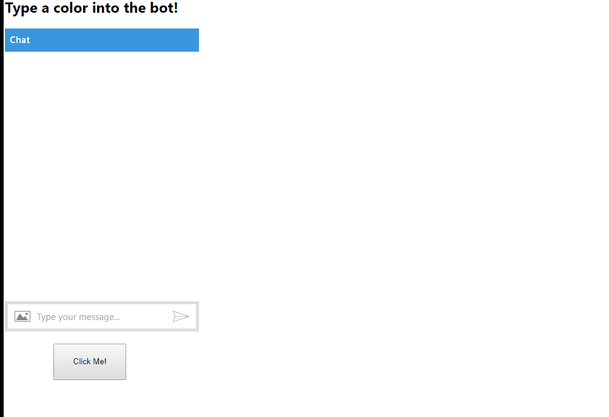

# Back Channel Bot

NOTE: Running this demo requires running the [WebChat backchannel sample page](https://github.com/billba/BotFramework-WebChat/tree/master/samples/backchannel) which sends events of activity name "buttonClicked" and receives events with activity name "changeBackground. 

This is a basic bot that uses the [DirectLine](https://docs.botframework.com/en-us/restapi/directline3/) backchannel to send and receive event messages to an instance of [WebChat](https://github.com/billba/BotFramework-WebChat).

This highlights the ability for a bot to communicate with a page that embeds the bot through WebChat. In other words, our bot can:

* Send events to a page that hosts an instance of WebChat - demonstrated by the bot sending an activity of type "event" and of name "changeBackground", which changes the background color of the parent page. 
* Listen for events from the page that hosts an instance of WebChat - demonstrated by the bot responding "I see you clicked that button" when it receives an event named buttonClicked.

To run the demo, pull the [WebChat repo](https://github.com/billba/BotFramework-WebChat) and follow instructions for running the samples. Create a bot from the [bot portal](dev.botframework.com) and (for testing) add keys to the connectorSetup.js file. Either [deploy the bot to Azure](https://docs.botframework.com/en-us/node/builder/guides/deploying-to-azure/) or [use ngrok to tunnel back into your machine](https://docs.botframework.com/en-us/node/builder/guides/core-concepts/#debugging-locally-using-ngrok) 

